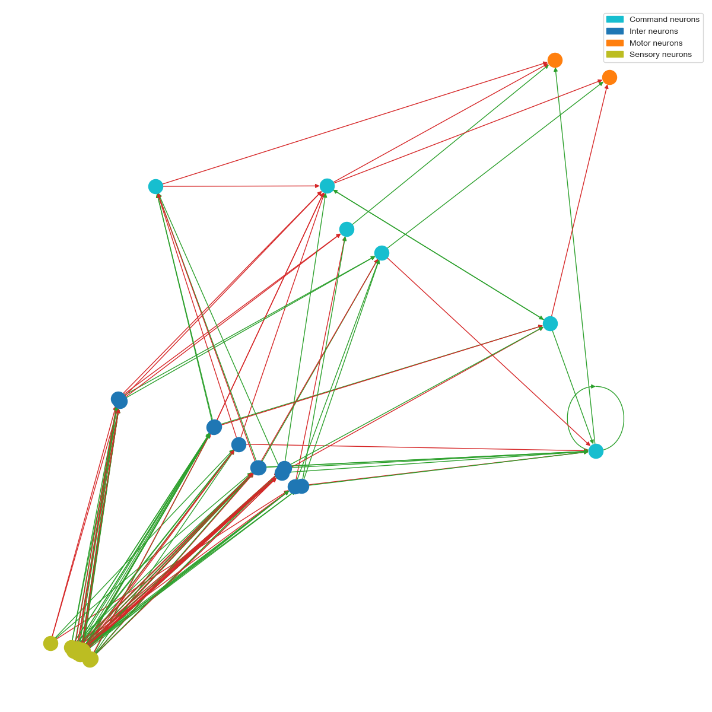
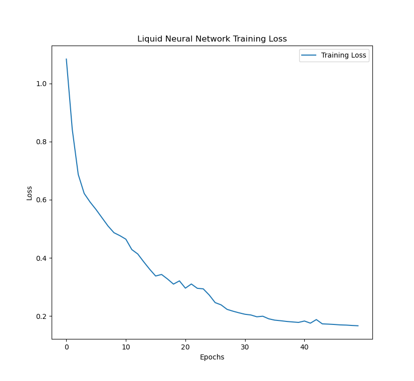
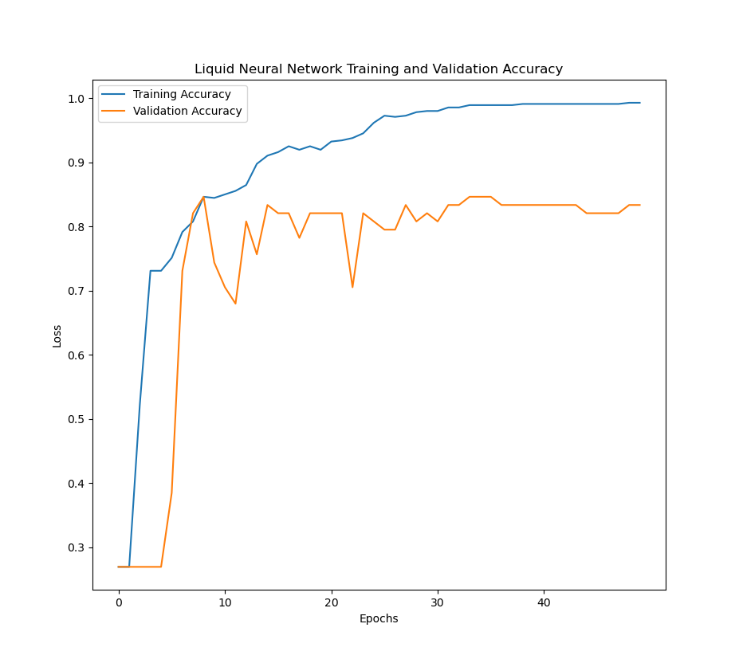
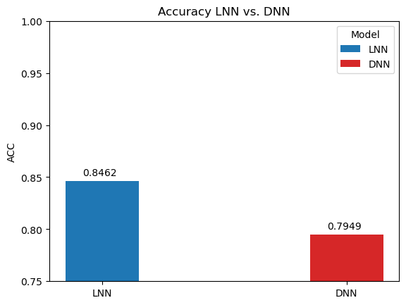
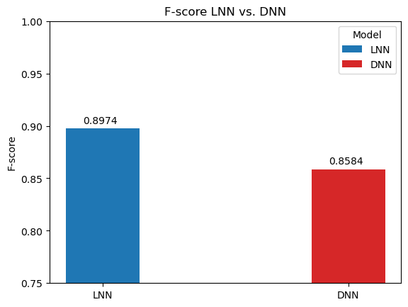
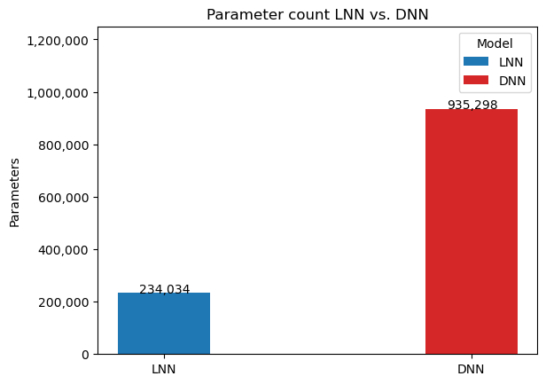

# Liquid neural networks for cancer classification

This project aims to use **liquid neural network** architecture to perform image classification on breast cancer ultrasounds from the [MedMNIST dataset](https://medmnist.com/).

### Background
Ramin Hasani et. al first introduced Liquid Time-constant networks, which allowed networks to have non-linear relationships that could vary themselves, rather than already be predefined. See [here](https://arxiv.org/abs/2006.04439).  
They then applied those within a Neural Circuit Policy (NCP) architecture, which was loosely based off the brain of the C. elegans worm. See [here](https://www.nature.com/articles/s41597-022-01721-8).

The MedMNIST v2 dataset is an opensource dataset of various collections of images for different medical tasks. This project trains off the BreastMNIST subset in order to classify breast ultrasound images as benign/normal (positive) or malignant (negative).  
Examples of ultrasound images:

### Network architecture
The detection pipeline first passes the images through a convolutional head, then puts the result through a 19-neuron within an NCP. Below is the wiring diagram of the NCP. .Notice the distinction between the different kinds of neurons, as well as the where the recurrent connections seem to be:

Some of the key advantages of the LNN is its relative sparsity compared to other architectures. This will be apparent in the comparison of the number of parameters later on.

### Training
The LNN model was trained over 50 epochs and a batch-size of 128. Cross entropy-loss was used for the model, as well as the Adam optimizer with a learning rate of 0.001 over. The training:validation:testing ratio was 7:1:2. The validation accuracy was measured after each epoch. 

### Results
Below are the figures of the training loss, training accuracy, and validation accuracy across epoch as the model was training.

When using the final testing set, the LNN model had the following scores:  
**Area under curve (AUC): 0.8897**  
**Accuracy (ACC) : 0.8462** 
**F1-score: 0.8974**  

In order to benchmark the results of the LNN, it was compared to a CNN network with just fully connected layers at the end, as well as a traditional deep neural network.

Notice the significant performance increases despite the difference in amount of parameters: 

Liquid neural networks are considerably less sparse, **yet still outperform the traditional deep neural networks on all metrics** over this breast cancer image classification task.